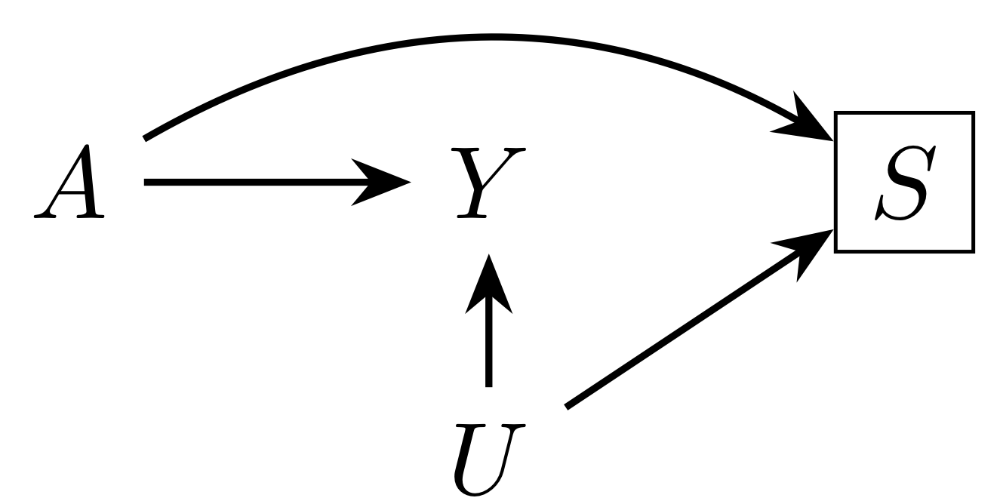
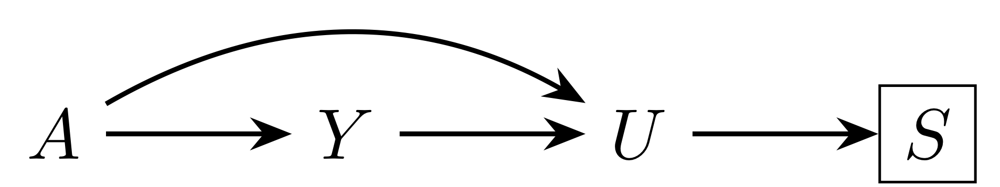
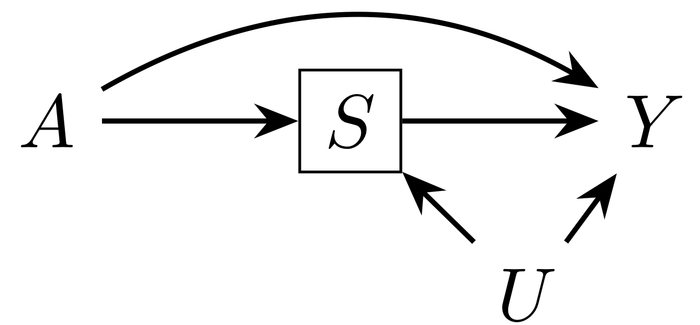
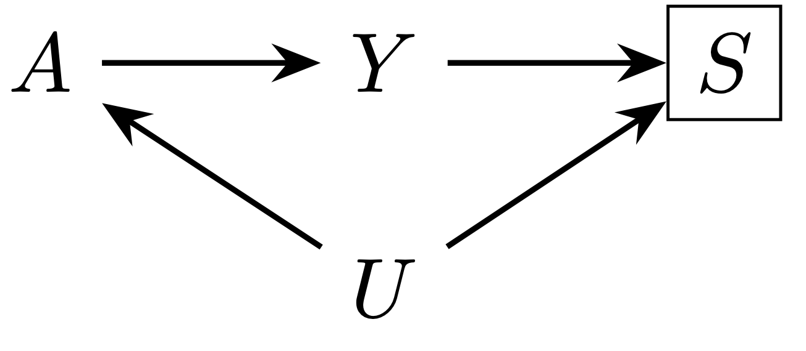

# Selection bias

Studies are often conducted in a subset of a population, whether by necessity or convenience. When the selected portion of the population differs from the total population with respect to the exposure and outcome of interest, selection bias can result. This may be the case even if the selected population is the only group about which you are attempting to make a causal claim.

However, it can be difficult to know the extent to which an estimate of a causal effect in a selected population systematically differs from the true causal effect, as it often depends on unmeasured factors. One way that you can deal with this uncertainty is by conducting a sensitivity analysis for selection bias. We have developed a simple approach for this:

- You can **compute bounds** based on hypothesized or estimated relationships with the unmeasured factor(s) creating the bias.
- You can **calculate selection bias E-values**, which describe the minimum strength that those relationships would have to have to explain away your estimate.

## Notation

Throughout, we refer to the exposure of interest as $A$, the outcome (or case-control status) as $Y$, and the fact of having been selected into the study as $S$ (equal to 1 for the selected population and 0 for the non-selected). We refer to the factor(s) responsible for the bias (due to their relationships with exposure, outcome, and selection) as $U$.

It is assumed throughout that any known and measured confounders $C$ have been adjusted for in the analysis. The parameters describing the extent of possible selection bias describe relationships *above and beyond* those factors that have already been included.

# Examples and graphical depictions

The following examples describe how being selected into the study could be related to an exposure and outcome of interest. Since selection bias can often be conceived on as [conditioning on a collider](https://journals.lww.com/epidem/fulltext/2004/09000/A_Structural_Approach_to_Selection_Bias.20.aspx) -- a variable that is directly affected by two (or more) other variables -- we also provide graphical depictions.

For each of these situations, we can either compute a bound for the possible extent of selection bias based on the relationships between the variables, or we can calculate a summary measure -- an E-value for selection bias -- to assess whether it is plausible that our result could be explained by selection bias. Each of these situations is accompanied by a numerical example in [the text](https://arxiv.org/pdf/1810.13402.pdf).

- Our causal question concerns the risk of microcephaly ($Y$) due to Zika virus infection ($A$). Some pregnancies are terminated, either spontaneously or electively, before microcephaly can be assessed.  Live and still births are therefore the selected population ($S$). However, terminations may differ by knowledge of exposure to Zika as well as factors such as education and health care access ($U$). These factors may also be related to risk of microcephaly. It may therefore be that some or all of the apparent risk of Zika may be due to the fact that the pregnancies most likely to not be terminated are also those most at risk of microcephaly for other reasons.

- Another question that has been considered is whether exogenous estrogen ($A$) causes endometrial cancer ($Y$). As an attempt to avoid underdetection of cancer, [one study selected](https://www.nejm.org/doi/full/10.1056/NEJM197811162992001?url_ver=Z39.88-2003&rfr_id=ori%3Arid%3Acrossref.org&rfr_dat=cr_pub%3Dpubmed) only women who had undergone hysterectomy or other diagnostic procedure ($S$). In this case we may consider indication for such a procedure to be $U$.  Because estrogen can increase the risk of bleeding or other reason for a diagnostic procedure, as can endometrial cancer itself, women could essentially be selected due to having the exposure *or* the outcome. This could make the two appear to be less likely to co-occur together, and [bias the estimate](https://www.jclinepi.com/article/0021-9681%2881%2990002-3/pdf) toward the null.

- The obesity paradox refers to the fact that obesity ($A$) appears to be protective against mortality ($Y$) compared to the normal weight BMI category among people with heart failure or other conditions ($S$).  However, it has been argued that this relationship is due to common causes of heart disease and death ($U$). Because obesity is known to increase the risk of heart disease as well, it could appear among the population with that condition that obesity increases survival: many of the non-obese people with heart disease have another condition that puts them at a higher risk of death.

- In case-control studies, selection bias can result when the distribution of exposure in the controls doesn't represent the exposure distribution in the source population.  For example, the question of whether coffee consumption ($A$) caused pancreatic cancer ($Y$) was considered in a [case-control study](https://www.nejm.org/doi/10.1056/NEJM198103123041102). However, it was later [pointed out](https://jamanetwork.com/journals/jama/article-abstract/361162) that the oversampling of patients with gastrointestinal disorders ($U$) as controls ($S$) could have resulted in a spurious association, as their coffee consumption was likely lower than the general population's due to their illness.