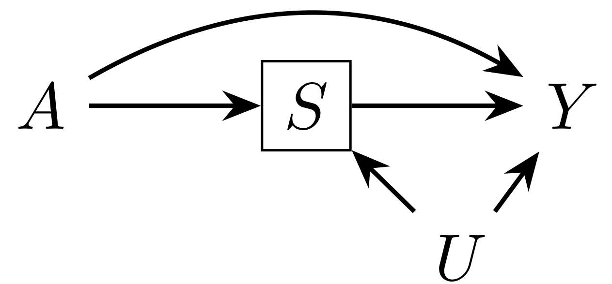

 
The obesity paradox refers to the fact that obesity ($A$) appears to be protective against mortality ($Y$) compared to the normal weight BMI category among people with heart failure or other conditions ($S$). However, it has been argued that this relationship is due to common causes of heart disease and death ($U$). Because obesity is known to increase the risk of heart disease as well, it could appear among the population with that condition that obesity increases survival: many of the non-obese people with heart disease have another condition that puts them at a higher risk of death.

 
 
 