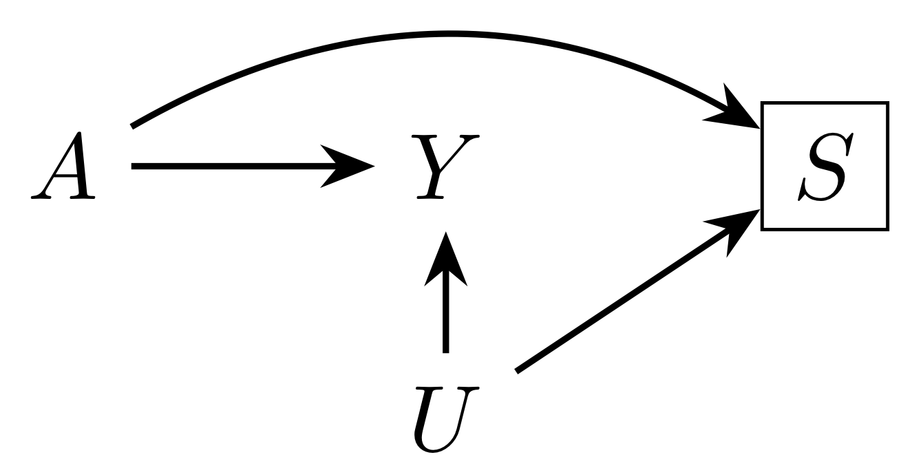

 
Our causal question concerns the risk of microcephaly ($Y$) due to Zika virus infection ($A$). Some pregnancies are terminated, either spontaneously or electively, before microcephaly can be assessed. Live and still births are therefore the selected population ($S$). However, terminations may differ by knowledge of exposure to Zika as well as factors such as education and health care access ($U$). These factors may also be related to risk of microcephaly. It may therefore be that some or all of the apparent risk of Zika may be due to the fact that the pregnancies most likely to not be terminated are also those most at risk of microcephaly for other reasons.

 
 
 
 
 